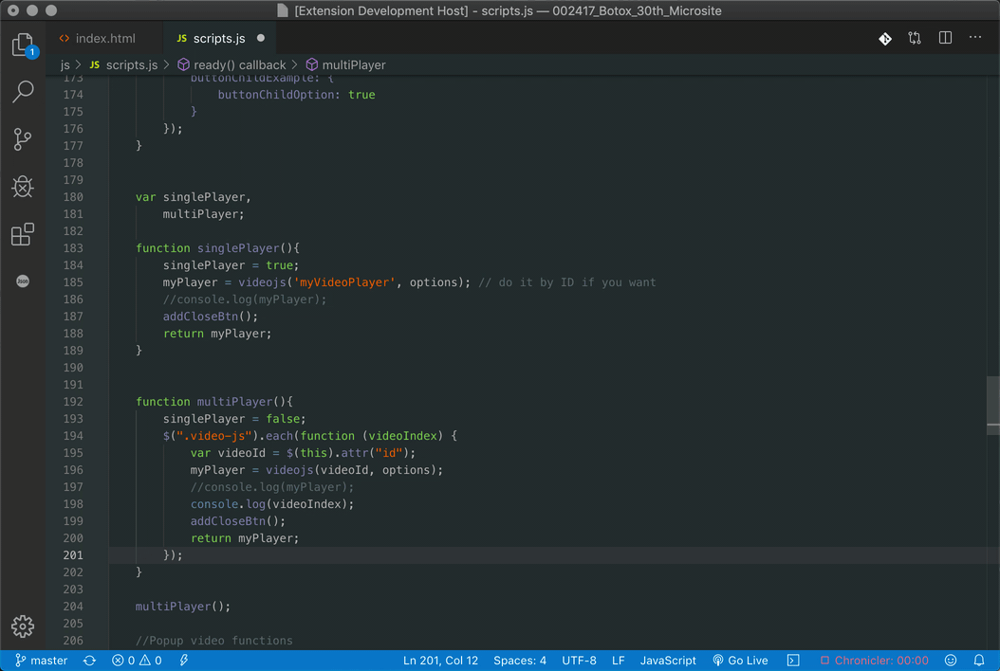

# eventlistener-intellisense README

Event-listener intellisense provides a small yet useful list of event listeners for the .on method in JQuery.

## Features

Type  '.on(' in any JS supported document to get a list of events to listen for. Should speed up coding a bit.

## Install
In Visual Studio Code, run `ext install eventlistener-intellisense` - or, simply hit `CMD/CTRL + Shift + P`, search for "Install Extension", and then search for "Eventlistener Intellisense".

## Contributions
Contributions are welcome, especially support for more languages and keywords. https://github.com/soulrelic616/eventlistener-intellisense

## License
MIT, please see LICENSE for details. Copyright (c) 2019 Bernardo Baldiviezo.

## Releases

### 0.0.1

Initial release
 